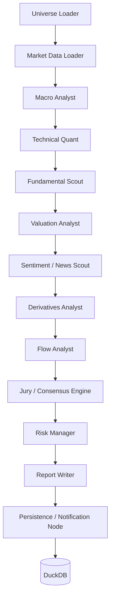

# Research Nifty: Multi-Agent Trading Research & Live Monitoring Platform

Production-structured, local-first research platform for Nifty 50 equities with LangGraph orchestration, Streamlit UI, policy learning gates, and live monitoring.

## Highlights
- LangGraph pipeline with 13 core agent nodes.
- Typed `ResearchState` and nested Pydantic v2 reports.
- NVIDIA Build (GLM) → Ollama → deterministic rules fallback LLM routing.
- Markdown + JSON report generation.
- Batch scans, live monitor loop, paper-trade replay, candidate policy comparison.
- DuckDB persistence for runs/outcomes/policies/LLM usage.
- Daily email digest support.

## Architecture


## 1) Local Setup (Linux/macOS)
```bash
python -m venv .venv
source .venv/bin/activate
pip install -r requirements.txt
cp .env.example .env
```

Then launch UI:
```bash
streamlit run app/streamlit_app.py
```

## 2) Local Setup (Windows PowerShell)
```powershell
python -m venv .venv
.\.venv\Scripts\Activate.ps1
pip install -r requirements.txt
copy .env.example .env
streamlit run app/streamlit_app.py
```

## 3) How to obtain environment variables
### Required for NVIDIA GLM (recommended)
- `NVIDIA_API_KEY`: create from NVIDIA Build portal account API key page.
- `NVIDIA_BASE_URL`: default `https://integrate.api.nvidia.com/v1`.
- `NVIDIA_MODEL`: set to `glm-4.7` (or any NVIDIA-hosted compatible model name you choose).

### Optional local fallback
- `USE_OLLAMA_FALLBACK=true`
- `OLLAMA_BASE_URL=http://localhost:11434`
- `OLLAMA_MODEL=qwen3:30b`

### Optional digest email
- `SMTP_HOST`, `SMTP_PORT`, `SMTP_USER`, `SMTP_PASSWORD`, `DIGEST_TO_EMAIL`

### Optional controls
- `ALLOW_AUTO_PATCH=false` (safe default)
- `MAX_DAILY_LLM_BUDGET_USD=10`

## 4) `.env` quick template
```env
NVIDIA_API_KEY=<your_nvidia_build_key>
NVIDIA_BASE_URL=https://integrate.api.nvidia.com/v1
NVIDIA_MODEL=glm-4.7
USE_OLLAMA_FALLBACK=true
OLLAMA_BASE_URL=http://localhost:11434
OLLAMA_MODEL=qwen3:30b
ALLOW_AUTO_PATCH=false
MAX_DAILY_LLM_BUDGET_USD=10
```

## 5) Run commands
```bash
# Single ticker research
python scripts/run_single.py --ticker RELIANCE.NS

# Batch scan
python scripts/run_batch.py --limit 10

# Live monitor (NSE-hours aware loop)
python scripts/run_live_monitor.py

# Replay / paper trading
python scripts/run_paper_trade.py

# Generate candidate policy
python scripts/retrain_policy.py

# Promotion-gate check for candidate policy
python scripts/promote_candidate.py

# Send daily digest
python scripts/send_digest.py
```

## 6) Make targets
```bash
make setup
make run
make batch
make live
make test
make digest
make retrain
make promote
```

## 7) Ollama setup (optional fallback)
```bash
ollama pull qwen3:30b
ollama serve
```

## 8) Sample outputs
- `outputs/samples/sample_summary_RELIANCE.json`
- `outputs/samples/sample_report_RELIANCE.md`
