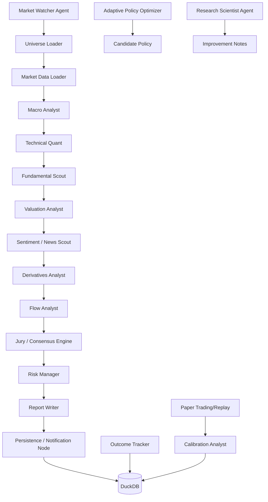

# Research Nifty: Multi-Agent Trading Research & Live Monitoring Platform

Production-structured, local-first research platform for Nifty 50 equities with LangGraph orchestration, Streamlit UI, policy learning gates, and live monitoring.

## Highlights
- LangGraph pipeline with 13 core agent nodes.
- Typed `ResearchState` and nested Pydantic v2 reports.
- OpenAI → Ollama → deterministic rules fallback LLM routing.
- Markdown + JSON report generation.
- Batch scans, live monitor loop, paper-trade replay, candidate policy comparison.
- DuckDB persistence for runs/outcomes/policies/LLM usage.
- Daily email digest with duplicate-safe operational pattern.
- Designed for local machine + Antigravity IDE; Docker optional.

## Architecture


## Repo Layout
```
research_nifty/
  app/streamlit_app.py
  src/
    config/
    graph/
    models/
    services/
    reports/
    utils/
  tests/
  scripts/
  outputs/samples/
  data/
```

## Setup (Linux/macOS)
```bash
python -m venv .venv
source .venv/bin/activate
pip install -r requirements.txt
cp .env.example .env
streamlit run app/streamlit_app.py
```

## Setup (Windows PowerShell)
```powershell
python -m venv .venv
.\.venv\Scripts\Activate.ps1
pip install -r requirements.txt
copy .env.example .env
streamlit run app/streamlit_app.py
```

## Ollama fallback
```bash
ollama pull qwen3:30b
ollama serve
```

## Make commands
```bash
make setup
make run
make batch
make live
make test
make digest
make retrain
make promote
```

## Run Scripts
- Single ticker: `python scripts/run_single.py --ticker RELIANCE.NS`
- Batch scan: `python scripts/run_batch.py --limit 10`
- Live monitor: `python scripts/run_live_monitor.py`
- Paper trade/replay: `python scripts/run_paper_trade.py`
- Candidate policy training: `python scripts/retrain_policy.py`
- Candidate policy promotion gate: `python scripts/promote_candidate.py`
- Daily digest: `python scripts/send_digest.py`

## Streamlit tabs
- Single Stock Research
- Batch Scan Dashboard
- Top Ideas
- Live Monitor
- History
- Strategy Performance
- Calibration
- Experiment Comparison
- Self-Improvement Proposals
- Model Usage / Cost
- Policy Promotion Controls

## Policy safety gates
- `ALLOW_AUTO_PATCH=false` default.
- Candidate policy evaluated before promotion (expectancy, drawdown, calibration).
- Production logic remains stable if candidate fails.

## Cost controls
- Content-hash LLM caching via DiskCache.
- Provider usage and estimated token cost logged in DuckDB.
- `MAX_DAILY_LLM_BUDGET_USD` configurable.
- Cost estimation helper for low-cost / balanced / premium modes.

## Notes for extension
Hooks are ready for broker execution adapters, factor ranking, event studies, vector memory, and MCP/tool-server integrations.

## Sample outputs
- `outputs/samples/sample_summary_RELIANCE.json`
- `outputs/samples/sample_report_RELIANCE.md`
